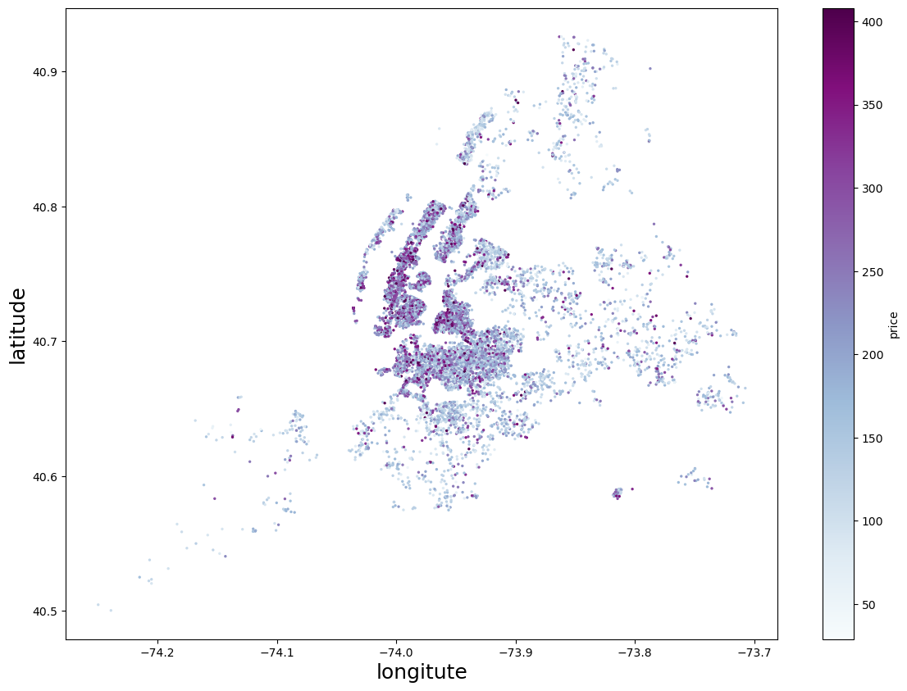
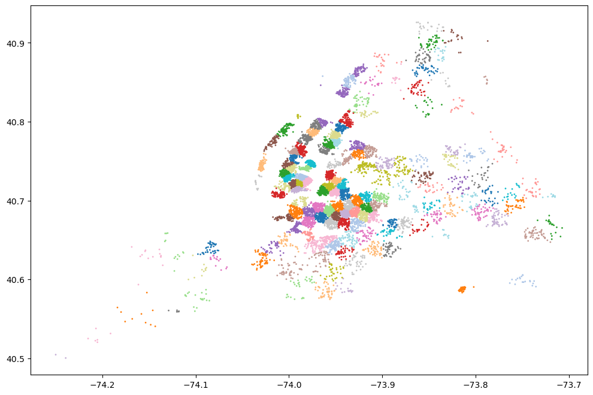

# Prediction Models for Airbnb's Acommodations Price
Data Analysis and Machine Learning on Airbnb Dataset

## Problem Statement
-----
The main purpose of this project is to develop a machine learning model that can predict prices for accommodations there to be listed on the Airbnb website.  Here we consider two types of audience, the main one being Airbnb interested in providing the user with a price suggestion during the listing process based on its main features such as type of accommodation, number of rooms and neighborhood. The secondary stakeholders would be people who are interested in using the Airbnb service by making their properties available for rent on their website and having an idea of how much this service could earn from it.

Several supervised and unsupervised machine learning models were developed considering the different characteristics of the dataset, pre-processing data,tunning tecniques and than evaluated according to their score and average error sum (RMSE) metrics.

Once the final model was selected, an App was developed to predict housing prices using the Streamlit library. This App, in addition to providing the price prediction model, provides an interface to interact with Airbnb data, making it possible to perform an exploratory analysis of the dataset by defining some parameters.

## Datasets 
----
Two data sets were used in this project. The first 'Listings.csv' with 39,881 rows and 75 columns was acquired through the Airbnb data explorer website [1] and contains information related to all accommodations listed on the website for the quarterly data for the last 12 months (Oct 2021 - Sept 2022). Another dataset was also used to add value to the modeling of our model - Neighborhood_price.csv - and was acquired in the data dashboard of the Street Easy website, which contains information regarding the real estate market in New York City and contains square foot prices for rentals in major its neighborhoods.

List of datasets:
* [`Listing.csv`](http://data.insideairbnb.com/united-states/ny/new-york-city/2022-09-07/data/listings.csv.gz) | [Dictionary](/data/dictionary.txt)
* [`Neighborhood_price.csv`](http://data.insideairbnb.com/united-states/ny/new-york-city/2022-09-07/data/listings.csv.gz) | [Dictionary](/data/dictionary_price.txt)

After cleaning the data, applying features engineering and input strategies we got a final dataset of size 23645 x 23 to training our machine learning models. 

(more analysis?!charts?)
## Machine Learning Models Evaluation
-----
The training dataset with 23 columns in total was scaled and hot encoded before being used to training  the models. Initially, a linear regression model was applied. 

We started our model evaluation checking the baseline model and getting its score which has a negative value of -0.0001 meaning that the model is pretty bad at predictions. 
At first, we implemented a linear regression model that got a score of xxx on the training set and xxx on the test set. This model could be a good choice in a regression model because its coefficintes can be used  to  interpret or inference the target if the LINE assumptions be met. In this particular case, the LINE assumptions were not met so we couldn't use its coefficients to inference. Then the following models were implemented: K-Nearest Neighbors Regression, Decision Tree Regressor, RainForest Regressor, Recurrent Neural Network associated with gridsearch and stacking techniques. 

Below is the benchmark table with the three models that had the best score among them.

(table)

The rain forest model was the one selected to be used in the Streamlit app to predict the prices simulation. The code for the app can be found at the app folder in this same repository.

In a second attempt, we try to apply transfer learning using clusters. so we create a new cluster column using KMeans() to replace the neighborhood column and see if the models performs better. For this, a search was performed for the best value of k (k=150), observing the silhouette value.

##  Recomendations and Conclusions
---
After analyzing the data, we can see that some variables are more important than others in determining the value of accomodation prices. For example, the xxxxx carries more weight than adding a xxxx of the accomodation.

Another conclusion that we can consider is that if you want to add value to accomodation it will be more efficient to include xxx than a xxxx

---
**References**: \
[1] [*Airbnb Get the Data Site*](http://insideairbnb.com/get-the-data/) \
[2] [*StreetEasy NYC Prices Data Dashboard*](https://streeteasy.com/blog/data-dashboard/)